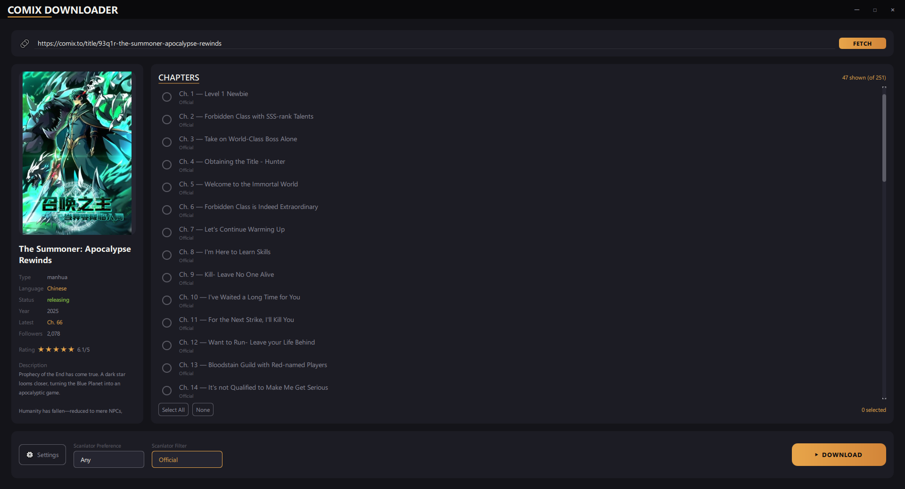

<div align="center">

# 🎨 Comix Downloader

[](https://python.org)
[](LICENSE)
[]()

**A beautiful manga downloader for [comix.to](https://comix.to) with GUI & CLI**

*Fast concurrent downloads • Multiple formats • Scanlator selection*

🚀 **Looking for the browser extension? Check out the [Comix Browser Extension](https://github.com/Yui007/comix-extension)!**



</div>

---

## ✨ Features

| Feature | Description |
|---------|-------------|
| 🖥️ **Modern GUI** | Beautiful PyQt6/QML interface with dark theme |
| 🔎 **Manga Discovery** | Search titles or browse trending/latest manga directly in the GUI |
| 🎨 **Beautiful CLI** | Rich terminal interface with progress bars |
| ⚡ **Concurrent Downloads** | Multi-threaded chapter and image downloads |
| 📁 **Multiple Formats** | Export as **Images**, **PDF**, or **CBZ** |
| 🎯 **Smart Selection** | Download single, range (`1-10`), or all chapters |
| 🎨 **Scanlator Filter** | Filter and prefer specific scanlator groups |
| ⚙️ **Persistent Settings** | CLI and GUI share one user settings file |

---

## 🚀 Installation

### Prerequisites
- Python 3.10 or higher
- pip (Python package manager)

### Quick Start

```bash
# Clone the repository
git clone https://github.com/Yui007/comix-downloader.git
cd comix-downloader

# Install dependencies
pip install -r requirements.txt

# Install Chrome browser (nodriver handles driver download automatically)
```

---

## 📖 Usage

### GUI Mode (Recommended)

```bash
# Run with GPU rendering (default)
python gui/main.py

# Run with CPU/Software rendering (for compatibility)
python gui/main.py --cpu
```

1. Search for a manga title in the Browse screen, or paste a manga URL from comix.to
2. Select a discovery result (or click **FETCH** for a URL) to load manga info and chapters
3. Select chapters and choose scanlator preference/filter
4. Click **DOWNLOAD CHAPTERS**
5. Access **⚙️ Settings** to configure format, output path, workers

### CLI Mode

```bash
# Interactive mode
python main.py

# Direct download
python main.py download "https://comix.to/title/abc-manga-name" -c "1-10" -f cbz
```

---

## ⚙️ Settings

Settings are stored in the platform user configuration directory so CLI and
GUI launches use the same values regardless of the current working directory.
The legacy root and `gui/config.json` files are imported once and left intact.

| Setting | Description | Default |
|---------|-------------|---------|
| Output Format | images / pdf / cbz | `images` |
| Keep Images | Retain images after PDF/CBZ conversion | `No` |
| Enable Logs | Show debug logging | `No` |
| Download Path | Where to save downloads | `downloads` |
| Max Chapter Workers | Concurrent chapter downloads | `3` |
| Max Image Workers | Application-wide concurrent image downloads | `5` |
| Run Browser Headless | Hide the automation browser window | `Yes` |

---

## 📁 Project Structure

```
comix-downloader/
├── main.py                 # CLI entry point
├── gui/
│   ├── main.py             # GUI entry point
│   ├── bridge/             # Python-QML bridges (downloads, details, discovery)
│   └── qml/                # QML UI components
├── src/
│   ├── api/comix.py        # API wrapper
│   ├── core/               # Models & downloader
│   ├── formats/            # PDF, CBZ, Images
│   ├── cli/                # CLI application
│   └── utils/              # Config, logging, session, compatibility helpers
├── tests/                  # Unit tests
└── config.json             # Legacy settings imported on first run
```

---

## 🔧 Dependencies

**GUI:**
- **[PyQt6](https://pypi.org/project/PyQt6/)** - Qt6 bindings for Python

**CLI:**
- **[Typer](https://typer.tiangolo.com/)** - CLI framework
- **[Rich](https://rich.readthedocs.io/)** - Beautiful terminal output

**Shared:**
- **[nodriver](https://github.com/sebdelsol/nodriver)** - Browser automation and canvas image extraction
- **[Requests](https://requests.readthedocs.io/)** - HTTP library
- **[Pillow](https://pillow.readthedocs.io/)** - Image processing
- **[ReportLab](https://www.reportlab.com/)** - PDF generation

> Note: The app includes a small compatibility shim for a `nodriver 0.50.3`
> source-encoding issue on Python 3.14. No manual edits inside `site-packages`
> are required.

---

## 📜 License

This project is licensed under the MIT License - see the [LICENSE](LICENSE) file for details.

---

## ⚠️ Disclaimer

This tool is for personal use only. Please respect the copyright of manga authors and publishers. Support official releases when available.

---

<div align="center">

**Made with ❤️ by [Yui007](https://github.com/Yui007)**

⭐ Star this repo if you find it useful!

</div>
